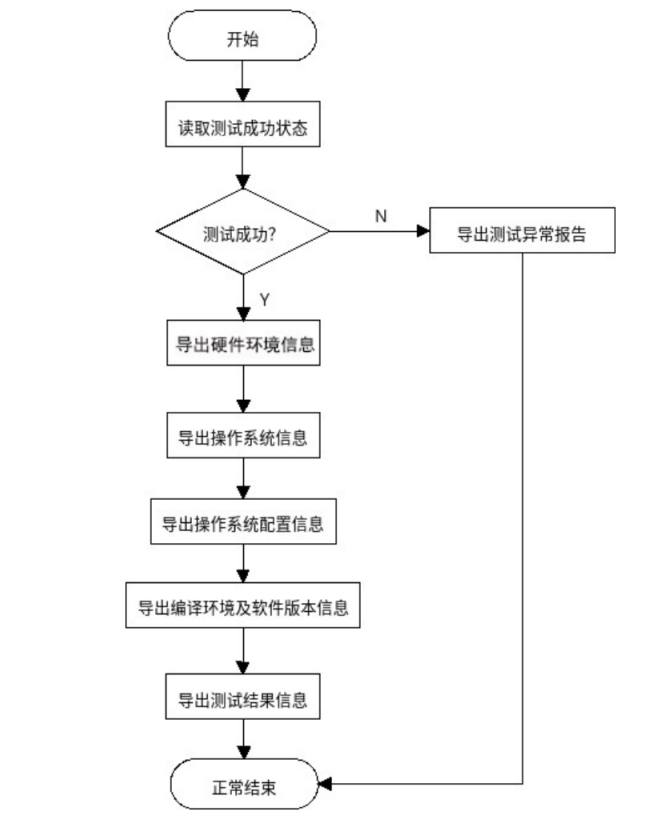

# kytuning-client

#### Introduction

In the process of OS benchmark performance optimization, there are often  various benchmarking tools, cumbersome data comparison, and a lack of  efficient tools for performance problem analysis. Kytuning provides a  tool to help complete tedious and repetitive tasks, freeing up manpower  and allowing engineers to focus on analyzing and solving performance  problems. 

Kytuning initially plans to support the following benchmarking tools: 

- unixbench
- lmbench
- fio
- iozone
- specjvm2008
- stream
- speccpu2006
- speccpu2017

#### Software Architecture
There are three main roles in the overall architecture of the KyTuning test  system: the target test machine, the KyTuning test system service, and  the web management client. 
kytuning-client is software that runs as a target tester, and its internal process is as follows: 

#### Installation

1.   yum install -y httpd

#### Instructions

1.   Build an HTTP server to store testing software
2.  Download kyting client
3.  Run sh run.sh

#### Contribution

1.  Fork the repository
2.  Commit your code
3.  Create Pull Request

#### Gitee Feature

1.  You can use Readme\_XXX.md to support different languages, such as Readme\_en.md, Readme\_zh.md
2.  Gitee blog [blog.gitee.com](https://blog.gitee.com)
3.  Explore open source project [https://gitee.com/explore](https://gitee.com/explore)
4.  The most valuable open source project [GVP](https://gitee.com/gvp)
5.  The manual of Gitee [https://gitee.com/help](https://gitee.com/help)
6.  The most popular members  [https://gitee.com/gitee-stars/](https://gitee.com/gitee-stars/)
